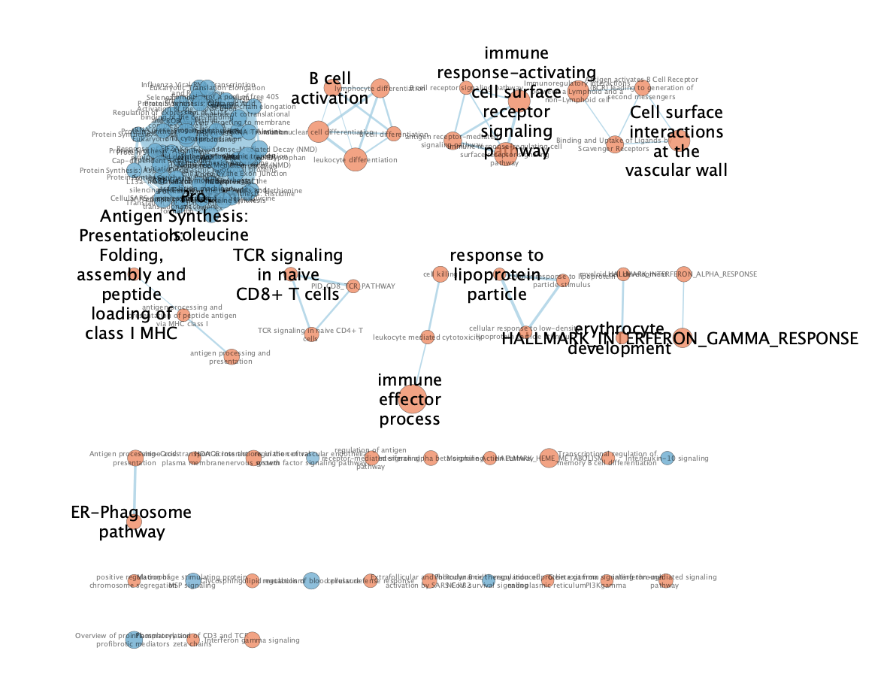
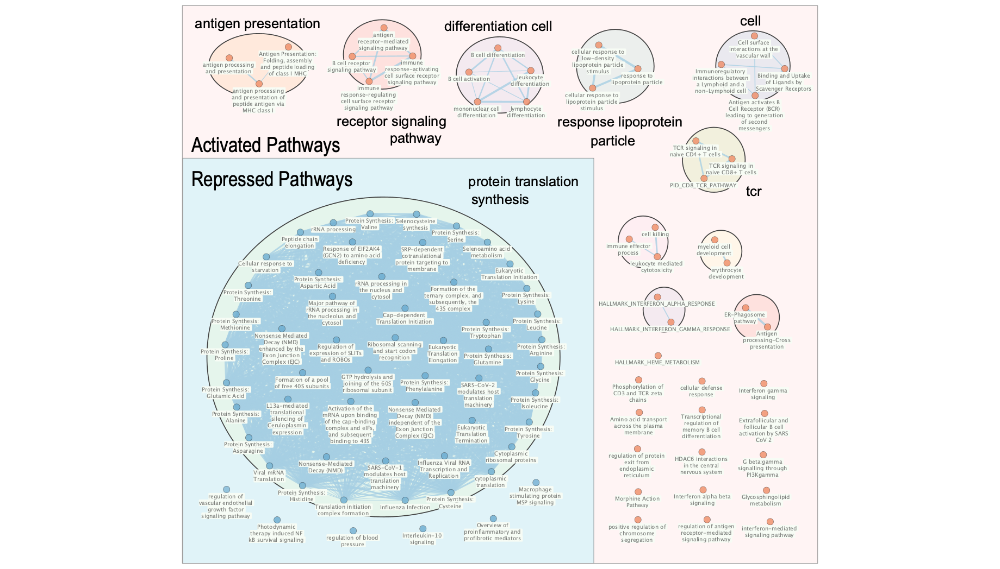
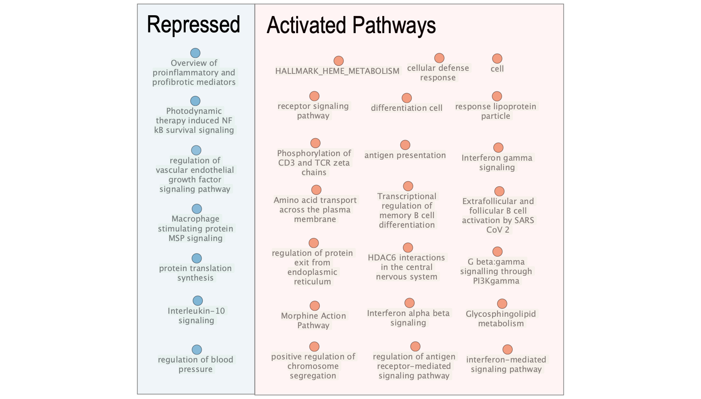

# Introduction {#introduction}

Non-severe aplastic anemia (non-SAA) is a rare hematologic disorder marked by bone marrow failure, leading to reduced blood cell production and increased susceptibility to infection and bleeding [@young_aplastic_2018]. Characterizing the molecular changes underlying non-SAA is essential for understanding disease mechanisms and identifying potential therapeutic targets. Bulk RNA-sequencing (RNA-seq) is commonly used for this analysis, enabling profiling of global gene expression in patient-derived samples relative to healthy controls [@noauthor_rnaseq_nodate].

A recent study by Zhu et al. used single-cell transcriptomics to dissect the molecular landscape of hematopoietic stem and progenitor cells (HSPCs) and T cells in patients with AA. The authors aimed to characterize lineage-specific gene expression alterations and transcriptional regulatory networks in residual HSPCs from AA patients and healthy controls at single-cell resolution. Included in this study was three primary data sets corresponding to full-length RNA-seq, 3' RNA-seq, and bulk RNA-seq of patients with severe (SAA) and non-severe aplastic anemia (non-SAA) and healthy donors. The study focused their analysis on the scRNA-seq datasets, whereas the bulk RNA-seq dataset was used for validation [@zhu_single-cell_2021].

In our prior work, we re-analyzed the publically available bulk RNA-seq dataset of Lin⁻CD34⁺ bone marrow cells from non-SAA patients and healthy donors (GEO: GSE165870). The original dataset comprised six non-SAA patients and three healthy controls; following quality control, one control was removed as an outlier, resulting in eight samples for downstream analysis [@zhu_single-cell_2021].

Low-count and duplicated genes were removed, and remaining counts were normalized using the Trimmed Mean of M-values (TMM) method to adjust for library size and compositional bias. After normalization, 10,984 genes were retained. The top 500 most variable genes were selected for variance-based analyses to capture informative expression differences while minimizing noise. Samples exhibited consistent library complexity and expression profiles, with no evidence of technical artifacts or hidden replicates, supporting suitability for differential expression and pathway enrichment analyses.

Differential expression analysis identified genes significantly up- or down-regulated in non-SAA patients relative to controls. This ranked gene list serves as the input for subsequent thresholded and non-thresholded gene set enrichment analyses, aiming to elucidate disease-associated pathways and processes.

------------------------------------------------------------------------

# Dataset Preparation {#dataset-preparation}

Our prior work done to prepare the dataset and perform differential analysis can be found [here](https://bcb420-2026.github.io/Sophia_Li/A1_SophiaLi.html).

## Data Importation {#data-importation}

Dataset acquisition, cleaning, preprocessing, and differential expression analysis was previously performed in assignment 1. Thus, we will use the intermediate and final objects produced by the preceding assignment for this assignment. We begin our dataset pathway and network analysis by importing all packages needed for this analysis. We will use `gprofiler2` [@kolberg_gprofiler2_2020] to perform thresholded over-representation analysis and `dplyr` [@wickham_dplyr_2023], `kableExtra` [@zhu_kableExtra], `knitr` [@stodden_knitr_2014], and `tibble` [@wickham_tibble] for general formatting.

```{r, message = FALSE, warning = FALSE}
library(gprofiler2)
library(dplyr)
library(kableExtra)
library(knitr)
library(tibble)
```

Next, we'll load our normalized counts data, metadata, and differential expression results from assignment 1. Our preprocessed and analyzed cohort consists of eight samples and 10983 genes.

```{r, message = FALSE, warning = FALSE}
# Load the data from `.csv` format
aa_data   <- read.csv("A2_data/aa_normalized_data.csv")
metadata  <- read.csv("A2_data/aa_metadata.csv")
diff_expr <- read.csv("A2_data/aa_differential_expression.csv")

# Set the gene symbols as the index
rownames(aa_data)   <- aa_data$X
rownames(metadata)  <- metadata$X
rownames(diff_expr) <- diff_expr$gene_symbol

# Remove the gene symbol artifact (not differential expression)
aa_data$X  <- NULL
metadata$X <- NULL

# Summarize the differential expression analysis results
kable(head(diff_expr), format = "html", caption = "Table 1: Differential expression analysis results of 10983 genes from assignment 1 using the `edgeR` package. Results include gene symbol, log fold-change (logFC), log counts-per-million (logCPM) logCPM, Quasi-Likelihood F-test statistic (F), p-value, and the false discovery rate (FDR) per gene.") %>% 
  kable_styling(bootstrap_options = "striped", full_width = FALSE)
```

------------------------------------------------------------------------

# Thresholded Over-Representation Analysis {#thresholded-overrepresentation-analysis}

Over-representation analysis (ORA), also known as thresholded enrichment analysis, evaluates whether specific gene sets are statistically over-represented among differentially expressed genes. This is assessed by comparing the observed overlap between a gene set and the list of significant genes to the expected overlap under a random distribution. Performing ORA requires defining a threshold of significance to classify genes as enriched or depleted in the disease condition [@isserlin_2026]. In the following sub-sections, we will perform ORA on the upregulated, downregulated, and all differentially expressed genes we previously identified in assignment 1.

We will perform ORA using the `gprofiler2` package (version 0.2.4) [@kolberg_gprofiler2_2020], a widely used and actively maintained tool for threshold enrichment. This method was chosen because it is highlighted in lecture material, where comprehensive tutorials were provided. Gene annotations will be drawn from GO Biological Processes (release 2025-03-16) [@gobp], Reactome (release 2025-05-23) [@reactome], and KEGG (release 2024-01-22) [@kegg] databases, selected for their broad coverage of pathways relevant to bulk RNA-seq studies. These annotation databases are both widely used and curated for pathway analysis, as well as actively maintained [@muley_functional_2025].

The original study did not perform ORA; therefore, the selection of method and annotation sources reflects informed methodological choices to enable meaningful pathway-level interpretation [@zhu_single-cell_2021].

## Gene Set Definition {#gene-set-definition}

To perform ORA, we must first define sets of upregulated and downregulated genes from the differentially expressed gene list. Thresholds are typically based on both statistical significance (p-values) and effect size (fold-change) [@isserlin_2026]. While false discovery rate (FDR)-adjusted p-values are standard, our previous analysis identified only eight downregulated and no upregulated genes after FDR correction. This is insufficient for ORA, as extremely small gene sets produce unstable enrichment results . [@genovese_2026].

To enable exploratory pathway discovery, we applied a more permissive FDR threshold of \< 0.25. Genes with log₂ fold-change \> 1.0 were classified as upregulated, and those with log₂ fold-change \< -1.0 as downregulated. These criteria balance statistical stringency with adequate gene set size for meaningful over-representation analysis [@reiner_identifying_2003].

```{r, message = FALSE, warning = FALSE}
# Define the upregulated, downregulated, and all gene sets with the thresholds
upregulated_genes   <- diff_expr$gene_symbol[which(diff_expr$FDR < 0.25 & diff_expr$logFC > 1.0)]
downregulated_genes <- diff_expr$gene_symbol[which(diff_expr$FDR < 0.25 & diff_expr$logFC < -1.0)]
ora_geneset <- union(upregulated_genes, downregulated_genes)

kable(tibble(
  category = c("Upregulated DE Genes",
               "Downregulated DE Genes",
               "All DE Genes Genes"),
  n        = c(length(upregulated_genes),
               length(downregulated_genes),
               length(ora_geneset)), 
), format = "html", caption = "Table 2: Summary of gene sets (FDR < 0.25, logFC > 1.0 / logFC < -1.0) used for thresholded over-representation analysis (ORA).") %>%
  kable_styling(bootstrap_options = "striped", full_width = FALSE)
```

After applying the exploratory thresholds (FDR \< 0.25; log₂ fold-change \> 1.0 or \< -1.0), 24 genes were classified as upregulated and 59 as downregulated. Although the upregulated gene set is small, the analysis remains interpretable, albeit with limited stability, and results should be treated with caution [@reiner_identifying_2003].

## Analysis of Upregulated Genes {#analysis-of-upregulated-genes}

We begin our ORA analysis by analyzing the upregulated gene set.

```{r, message = FALSE, warning = FALSE}
# Run the `g:Profiler` package on the upregulated genes as the query set
upreg_gprofiler_results <- gost(
  query             = upregulated_genes,
  significant       = TRUE,
  ordered_query     = FALSE,
  exclude_iea       = TRUE,
  correction_method = "fdr",
  organism          = "hsapiens",
  sources           = c("GO:BP", "REAC", "KEGG")
)

# Parse the ORA results into a cleaned dataframe
upreg_ora_results <- upreg_gprofiler_results$result %>%
  select(-query, -significant, -parents, -source_order, -recall,
         -effective_domain_size)

kable(upreg_ora_results, format = "html", caption = "Table 3: Thresholded over-representation analysis (ORA) results of upregulated genes (FDR < 0.25, logFC > 1.0). Eight significant terms are identified in Go Biological Process.") %>% 
  kable_styling(bootstrap_options = "striped", full_width = FALSE)
```

Over-representation analysis of the upregulated gene set returned eight significant GO Biological Process terms, all related to immune function, including B cell activation, proliferation, and receptor signaling, as well as general immune and lymphocyte activation processes. No significant pathways were identified from Reactome or KEGG. These results suggest that upregulated genes in non-SAA samples are primarily associated with adaptive immune system activity [@pakoszebrucka_integrated_2016].

## Analysis of Downregulated Genes {#analysis-of-downregulated-genes}

We continue our ORA analysis by analyzing the downregulated gene set. Notably, we saw that all significantly differentially expressed genes identified in assignment 1 with a threshold of FDR \< 0.05 were downregulated. While we are currently using an exploratory set of downregulated genes with a looser threshold for significance, our results will still be informative regarding the expression profiles between our disease groups.

```{r, message = FALSE, warning = FALSE}
# Run the `g:Profiler` package on the downregulated genes as the query set
downreg_gprofiler_results <- gost(
  query             = downregulated_genes,
  significant       = TRUE,
  ordered_query     = FALSE,
  exclude_iea       = TRUE,
  correction_method = "fdr",
  organism          = "hsapiens",
  sources           = c("GO:BP", "REAC", "KEGG")
)

# Parse the ORA results into a cleaned dataframe
downreg_ora_results <- downreg_gprofiler_results$result %>%
  select(-query, -significant, -parents, -source_order, -recall,
         -effective_domain_size)

kable(downreg_ora_results, format = "html", caption = "Table 4: Thresholded over-representation analysis (ORA) results of downregulated genes (FDR < 0.25, logFC < -1.0). Eight significant terms are identified in Reactome.") %>% 
  kable_styling(bootstrap_options = "striped", full_width = FALSE)
```

Over-representation analysis of the downregulated gene set returned eight significant Reactome pathways, all related to EGFR signaling and clathrin-mediated endocytosis. No significant pathways were identified from GO Biological Process terms or KEGG. These findings indicate that genes with reduced expression in non-SAA samples are associated with receptor-mediated signaling and intracellular trafficking processes, suggesting potential alterations in growth factor signaling and endocytic regulation between disease and control groups [@pakoszebrucka_integrated_2016].

## Analysis of All Significant Genes {#analysis-of-all-significant-genes}

Finally, we conclude our ORA analysis by analyzing all differentially expressed genes in our exploratory set.

```{r, message = FALSE, warning = FALSE}
# Run the `g:Profiler` package on the downregulated genes as the query set
ora_gprofiler_results <- gost(
  query             = ora_geneset,
  significant       = TRUE,
  ordered_query     = FALSE,
  exclude_iea       = TRUE,
  correction_method = "fdr",
  organism          = "hsapiens",
  sources           = c("GO:BP", "REAC", "KEGG")
)

# Parse the ORA results into a cleaned dataframe
ora_results <- ora_gprofiler_results$result %>%
  select(-query, -significant, -parents, -source_order, -recall,
         -effective_domain_size)

kable(ora_results, format = "html", caption = "Table 5: Thresholded over-representation analysis (ORA) results of all differentially expressed genes (FDR < 0.25, |logFC| > 1.0). Eight significant terms are identified in Go Biological Process.") %>%
  kable_styling(bootstrap_options = "striped", full_width = FALSE)
```

Over-representation analysis of the combined exploratory gene set returned five Reactome pathways, all related to EGFR signaling and clathrin-mediated endocytosis. This result is somewhat unexpected, as pathways are typically enriched in either up- or down-regulated genes rather than a mixed set. The small pathway sizes and limited gene overlap suggest these findings are marginal and should be interpreted cautiously, as they may reflect stochastic effects rather than robust biological trends [@hong_separate_2014].

## Interpretation {#interpretation-thresholded}

### Summary of Results {#summary-of-results-thresholded}

Thresholded over-representation enrichment analysis using `g:profiler` [@kolberg_gprofiler2_2020] of the differentially expressed genes from assignment 1 revealed broad patterns of pathway activation and representation between on-SAA and healthy samples in our cohort. Exploratory thresholds (FDR \< 0.25; log₂ fold-change \> 1.0 or \< -1.0) were used to define the upregulated and downregulated gene sets, composed of 24 and 59 genes respectively.

Analysis of the upregulated gene set resulted in eight significant terms from GO Biological Process, all of which relating to immune function. This included B cell activation, proliferation, and receptor signaling, as well as general immune and lymphocyte activation processes.

Analysis of the downregulated gene set resulted in eight significant terms from Reactome, all of which relating to EGFR signaling and clathrin-mediated endocytosis.

Analysis of the full exploratory set of differentially expressed genes resulted in five significant terms from Reactome, all of which relating to EGFR signaling and clathrin-mediated endocytosis. All significant terms identified in the full set overlap with the terms identified in the analysis of the downregulated gene set.

### Analysis by Direction {#analysis-by-direction}

Analysis of the combined gene set primarily recapitulated the downregulated pathways, implying that enrichment is being driven by downregulated genes. Downregulated genes dominated the differentially expressed list when applying the exploratory thresholds, thus resulting in stronger over-representation statistics. This is especially true when the upregulated and downregulated gene sets are analyzed separately, where we identified eight enriched pathways when analyzing downregulated genes separately and only five when analyzed together [@hong_separate_2014].

Genes within pathways tend to be positively co-expressed, thus leading to an imbalance in up versus down differentially expressed genes in specific pathways. Analyzing all differentially expressed genes in our exploratory set together can dilute the directional signal and reduce statistical power in detecting enrichment, while separate analysis recovers more biologically relevant pathways [@hong_separate_2014].

### Comparison with Original Paper {#comparison-with-original-paper-thresholded}

These observations are broadly consistent with the original study and are capturing a more specific and upstream layer of regulation that likely feeds into the broader outcomes that they describe. Our enrichment results are more mechanistic than the paper's higher-level summary of regulation in non-SAA patients, highlighting immune activation and dampened growth-factor/endocytic signaling.

The upregulation of B cell activation, proliferation, receptor signaling, and general lymphocyte activation fully aligns with the original study's reported regulation of cell death, cytokine signaling, and immune activation. B-cell receptor, co-stimulatory, and cytokine pathways are tightly integrated, and serve as more granular terms that refine the broader statement of immune and cytokine signaling [@li_transcriptional_2017].

The downregulation of EGFR and signaling and clathrin-mediated endocytosis supports proliferation, survival, and cell cycle progression, being directionally consistent with the shift towards reduced cell cycle activity and increased cell death susceptibility reported in the original study. Clathrin-mediated endocytosis is critical for receptor internalization (including EGFR) and for trafficking many signaling receptors, where its repression is frequently altered in disease transcriptomics alongside cell cycle and differentiation pathways. Furthermore, large-scale changes in RNA processing, including alternative splicing and polyadenylation as reported in the original study, often co-occur with changes in growth factor signaling and endocytic machinery as part of a broader reprogramming of cell fate and proliferation [@li_transcriptional_2017].

### Support of Findings {#support-of-findings-thresholded}

Multiple studies have shown strong activation of adaptive immunity, enhanced cell-cell immune interactions, and antigen-presenting cells in both severe and non-severe AA. While they often emphasize T and myeloid compartments, they consistently show global immune activation which aligns with our findings. Particularly, our enrichment of B-cell activation, lymphocyte activation, and receptor signaling biologically plausible within the same immune-driven framework [@young_aplastic_2018].

In contrast, AA literature primarily focuses on TGF‑β, JAK/STAT, VEGF–Notch and immune checkpoints, rather than EGFR signaling [@zhang_tgf-_2025]. While EGFR and its endocytic control are well-known regulators of cell proliferation and survival, reduced EGFR signaling can favour impaired hematopoeisis and increased vulnerability to immune-mediated damage [@vieira_control_1996]. Furthermore, clathrin-mediated and non-clathrin EGFR endocytosis are critical determinants of downstream EGFR signaling strength and fate decisions [@vieira_control_1996]. Thus, while no AA study directly reports global repression of these pathways, they appear as novel but mechanistically coherent with the disease.

```{r, message = FALSE, warning = FALSE}
rm(upreg_gprofiler_results, downreg_gprofiler_results, ora_gprofiler_results,
   downregulated_genes, ora_geneset, upregulated_genes, downreg_ora_results,
   ora_results, upreg_ora_results)
```

------------------------------------------------------------------------

# Non-Thresholded Gene Set Enrichment Analysis {#nonthresholded-gene-set-enrichment-analysis}

## GSEA Analysis {#gsea-analysis}

Gene Set Enrichment Analysis (GSEA) provides a complementary approach to over-representation analysis by evaluating the enrichment of gene sets across the entire ranked list of genes, rather than relying on an arbitrary threshold to define up- and downregulated subsets [@GSEA2005]. For our analysis, all genes identified as differentially expressed in assignment 1 will be ranked ranked using a signed statistic derived from both p-value and fold-change. This ranking preserves the directionality and magnitude of expression changes, enabling detection of coordinated pathway-level signals that may be subtle or distributed across multiple genes [@isserlin_2026].

```{r, message = FALSE, warning = FALSE}
# Rank the differentially expressed genes by ranking score (p-value & FC)
ranked_genes <- diff_expr %>%
  mutate(rank = -log10(PValue) * sign(logFC)) %>%
  select(gene_symbol, rank) %>%
  arrange(desc(rank))

# Rename the gene_symbol column to gene for compatibility with GSEA
colnames(ranked_genes)[1] <- "gene"

# Save the ranked genes as a `.rnk` file for GSEA
rnk_file <- "A2_data/aa_vs_healthy.rnk"
if (!file.exists(rnk_file)) {
  write.table(
    ranked_genes,
    file      = rnk_file,
    sep       = "\t",
    row.names = FALSE, 
    col.names = FALSE,
    quote     = FALSE
  )
}
```

Pathway-level interpretation of GSEA requires a curated collection of gene sets [@isserlin_2026]. For this analysis, we utilized the September 1, 2025 release of the gene sets provided by the Bader laboratory [@BaderLab2025; @MSigDB2015]. This specific release was selected deliberately: while a more recent release (March 2, 2026) was available at the time of analysis, it contains duplicate gene set names and is not provided in standard GMT format, which precludes correct export and integration into the GSEA workflow. A similar issue was brought up on the course discussion board that has not yet been responded to by instructors as of March 8, two days before the assignment deadline. Thus, we will proceed with using the prior release. Using the September 2025 release ensures compatibility with standard GSEA tools and preserves the integrity of gene set annotations [@BaderLab2025].

```{r, message = FALSE, warning = FALSE}
# Fetch the (09/01/2025) release from when this analysis was performed 
gmt_url       = "https://download.baderlab.org/EM_Genesets/September_01_2025/Human/symbol/"
gmt_file      = "Human_GOBP_AllPathways_noPFOCR_no_GO_iea_September_01_2025_symbol.gmt"
dest_gmt_file = file.path("/home/rstudio/projects/A2_data", gmt_file)

# Download the geneset if its not found at the specified destination
if (!file.exists(dest_gmt_file)) {
  download.file(
    paste(gmt_url, gmt_file, sep = ""),
    destfile = dest_gmt_file
  )
}
```

We will perform enrichment analysis using the standalone GSEA CLI (version 4.4.0) using a system cell [@GSEA2005]. The pre-ranked method will be used with the list we have generated, with 1000 permutations, a weighted scoring scheme, gene set size limits of 15-200 genes, and a fixed random seed of 12345 to ensure reproducibility.

To avoid rerunning the computationally intensive analysis during document compilation, the `run_gsea` flag is set to FALSE; setting it to TRUE triggers a new execution. All analyses were conducted within the bcb420-winter-2026 Docker environment, which contains the required GSEA CLI .sh executable, ensuring a consistent and reproducible computational environment [@GSEA2005; @isserlin_2026].

```{r, message = FALSE, warning = FALSE}
# Set this to TRUE to run a new instance of GSEA
run_gsea <- FALSE

# Set GSEA parameters based on your current directory paths
analysis_name <- "aa_vs_healthy"
working_dir   <- "./"
output_dir    <- "./A2_gsea_results"
gsea_jar      <- "/home/rstudio/GSEA_4.4.0/gsea-cli.sh"

# Run a new instance of GSEA if toggled
if (run_gsea) {
  command <- paste(
    "", gsea_jar,  
    "GSEAPreRanked -gmx", dest_gmt_file, 
    "-rnk", file.path(working_dir, rnk_file), 
    "-collapse false -nperm 1000 -scoring_scheme weighted", 
    "-rpt_label ", analysis_name,
    "  -plot_top_x 20 -rnd_seed 12345  -set_max 200",  
    " -set_min 15 -zip_report false ",
    " -out", output_dir, 
    " > gsea_output.txt", sep = " "
  )
  system(command)
}
```

The system call to GSEA will output its results into an `HTML` file which we will parse. If a new GSEA query was performed, update the value of `gsea_results_dir` with the outputted directory name to properly display the results.

```{r, message = FALSE, warning = FALSE, results = "asis", echo = FALSE}
# Change this path if a new query was performed
gsea_results_dir <- "aa_vs_healthy.GseaPreranked.1772746541462"

# Extract the results and embed it
gsea_results <- file.path(output_dir, gsea_results_dir, "index.html")
cat(sprintf(
  '<iframe src="%s" height="800px" width="100%%" frameborder="0"></iframe>',
  gsea_results
))
```

Of the 18971 gene sets initially retrieved from the September 1, 2025 Bader lab release, 14,077 were excluded due to size filtering (gene sets outside the 15–200 gene range), leaving 4,894 gene sets for analysis. Among these, 3,248 gene sets were enriched in the disease state, whereas 1,646 were enriched in the control state. These counts reflect the overall distribution of pathway-level differential activity, with a predominance of upregulated pathways in the disease condition.

## Enrichment Map {#enrichment-map}

To facilitate the interpretation of our non-thresholded enrichment results from GSEA, we will generate an enrichment map using the Desktop Version of Cytoscape (version 3.10.4) [@Cytoscape2003]. The EnrichmentMap pipeline collection (version 1.1.0), downloaded from the Cytoscape App Store, will be used to convert the GSEA output into a network representation, where each node corresponds to a gene set and edges indicate overlap between gene sets [@EnrichmentMap2010]. This network-based visualization will allow us to intuitively interpret the relationships between enriched pathways, identification of subnetwork clusters, and assess central or highly connected nodes [@isserlin_2026].

### Basic Map {#basic-map}

We will use the GSEA run performed in the prior section to generate our enrichment map [@GSEA2005]. The following parameters were used to create the map using Cytoscape:

```{r, message = FALSE, warning = FALSE}
# Define the Cytoscape parameter fields
parameter_fields <- c(
  "Analysis Type", 
  "Phenotypes",
  "FDR q-value cutoff",
  "Positive enrichments",
  "Negative enrichments",
  "GMT gene sets",
  "Ranked gene list",
  "Expression matrix"
)

# Define the Cytoscape parameter values
parameter_values <- c(
  "GSEA",
  "AA (Up), Healthy (Down)",
  "0.05",
  "~/projects/A2_gsea_results/aa_vs_healthy.GseaPreranked.1772746541462/gsea_report_for_na_pos_1772746541462.tsv",
  "~/projects/A2_gsea_results/aa_vs_healthy.GseaPreranked.1772746541462/gsea_report_for_na_neg_1772746541462.tsv",
  "~/projects/A2_data/Human_GOBP_AllPathways_noPFOCR_no_GO_iea_September_01_2025_symbol.gmt",
  "~/projects/A2_data/aa_vs_healthy.rnk",
  "~/projects/A2_data/aa_normalized_data.csv"
)

# Visualize the parameters as a table
kable(tibble(
  category = parameter_fields,
  n        = parameter_values, 
), format  = "html", caption = "Table 6: Cytoscape parameters used to generate the enrichment map.") %>% 
  kable_styling(bootstrap_options = "striped", full_width = FALSE)
```

With these parameters, Cytoscape will create the following rough unformatted map.

```{r, message = FALSE, warning = FALSE, fig.cap = "**Figure 1:** Initial enrichment map prior to annotation and formatting."}

```

Inspecting our map's metadata prior to manual layout and filtering, we see that there are 104 nodes and 1305 edges.

### Final Map {#final-map}

To create our final enrichment map, we must manually annotate and format it. We will use the AutoAnnotate package [@AutoAnnotate2016], manual annotation, and style panels in Cytoscape to format the final map with the following parameters:

```{r, message = FALSE, warning = FALSE}
# Define the Clustering parameter fields
cluster_parameter_fields <- c(
  "Cluster Creation", 
  "Layout Network to Minimize Cluster Overlap",
  "Max Words per Label",
  "Minimum Word Occurrence",
  "Adjacent Word Bonus"
)

# Define the Clustering parameter values
cluster_parameter_values <- c(
  "Use clusterMaker2 App",
  "Yes",
  "3",
  "1",
  "8"
)

# Visualize the parameters as a table
kable(tibble(
  category = cluster_parameter_fields,
  n        = cluster_parameter_values, 
), format  = "html", caption = "Table 7: Cytoscape clustering parameters used to generate the enrichment map.") %>% 
  kable_styling(bootstrap_options = "striped", full_width = FALSE)
```

```{r, message = FALSE, warning = FALSE}
# Define the style parameter fields
style_parameter_fields <- c(
  "Label Fond Size", 
  "(Node) Size",
  "Label Position",
  "Label Background Colour",
  "Label Background Shape",
  "Repressed Pathways Box",
  "Activated Pathways Box"
)

# Define the style parameter values
style_parameter_values <- c(
  "12",
  "15",
  "(Manually adjusted to below)",
  "Light Green",
  "Rounded Rectangle",
  "Light Blue, Border Width of 1",
  "Light Red, Border Width of 1"
)

# Visualize the parameters as a table
kable(tibble(
  category = style_parameter_fields,
  n        = style_parameter_values, 
), format  = "html", caption = "Table 8: Cytoscape styling parameters used to generate the enrichment map.") %>% 
  kable_styling(bootstrap_options = "striped", full_width = FALSE)
```

Thus, using the parameters as defined above, we generate the following formatted and clsutered enrichment map.

```{r, message = FALSE, warning = FALSE, fig.cap = "**Figure 2:** Pathway enrichment map of non-SAA versus healthy patients. Repressed pathways are shown in blue and activated pathways are shown in red. Smaller node labels highlighted in light green indicate pathway labels, and larger non-highlighted labels indicate cluster labels. The size of the cluster labels are uniform and do not reflect their size."}

```

## Theme Network {#theme-network}

Finally, we will further collapse our final enrichment map into a theme network. This will be achieved by pulling only the cluster names that are present to highlight if major themes are present in our enrichment map.

```{r, message = FALSE, warning = FALSE, fig.cap = "**Figure 3:** Theme network enrichment map of non-SAA versus healthy patients. Repressed pathways are shown in blue, and activated pathways are shown in red."}

```

```{r, message = FALSE, warning = FALSE}
rm(aa_data, diff_expr, metadata, ranked_genes, analysis_name, dest_gmt_file,
   gmt_file, gmt_url, gsea_jar, gsea_results, gsea_results_dir, output_dir,
   rnk_file, run_gsea, working_dir, cluster_parameter_fields, cluster_parameter_values,
   parameter_fields, parameter_values, style_parameter_fields, style_parameter_values)
gc()
```

## Interpretation {#interpretation-nonthresholded}

### Summary of Results {#summary-of-results-nonthresholded}

Non-thresholded gene set enrichment analysis using GSEA [@GSEA2005] of the ranked gene list from assignment 1 revealed broad patterns of pathway activation and repression between non-SAA and healthy samples in our cohort. Among 4894 analyzed gene sets (after applying gene set size filters of 15-200, which excluded 14077 out of 18971 sets), 3248 gene sets were upregulated in non-SAA samples, of which 255 reached significance at the chosen threshold of FDR \< 0.25. In contrast, 1646 gene sets were upregulated in healthy samples (also referred to as downregulated in our analysis), with 107 significantly enriched at the same threshold. The dataset included 10983 gene features for the marker comparison.

Enrichment map visualization using Cytoscape [@Cytoscape2003] comprised 104 nodes and 1305 edges with a high clustering coefficient of 0.997. The primary cluster comprised repressed pathways related to protein translation and synthesis (51 nodes), along with six singleton repressed nodes. Smaller upregulated clusters contained between 2-5 nodes each, encompassing pathways such as antigen presentation (4 nodes), receptor signaling (4), cellular differentiation (5), lipoprotein particle response (3), general cell processes (4), and T cell receptor signalling (3), alongside 16 singleton upregulated nodes.

### Major Network Themes {#major-network-themes}

The theme network, which collapsed the enrichment map into only named clusters, contained 7 repressed and 21 activated clusters for a total of 28. Notably, no edges connected nodes in the theme network, suggesting that the primary functional relationships were functionally discrete within the network structure, rather than across clusters.

Major themes in the repressed network corresponded to protein translation and biosynthetic processes, consistent with reduced proliferative or metabolic activity in non-SAA samples [@zhu_single-cell_2021]. Activated themes predominately involved immune-related processes, including antigen presentation, receptor signaling, and T cell activation, fitting the expected model of immune activation in disease [@wu_human_2025]. Several smaller activated clusters, such as lipoprotein particle response and cellular differentiation, may represent novel or less well-characterized pathways that warrant further investigation.

### Comparison with Original Paper {#comparison-with-original-paper-nonthresholded}

Our enrichment analyses largely corroborate the activated mechanisms reported in the original study. Upregulated gene sets in non-SAA samples were dominantly immune-related processes, including antigen presentation, receptor signaling, and T cell activation, consistent with the paper's observation of increased immune and cytokine signaling [@zhu_single-cell_2021].

However, the original paper reported repression of alternative splicing and skewed polyadenylation, rather than the global ribosome/translation signature we identified. While these are both post-transcriptional regulatory phenomena, and repressed translation and biosynthesis can reflect downstream consequences of altered RNA processing in stressed hematopoeisis, this is interpretive and not explicitly shown. Therefore, we must cautiously interpret the alignment of our findings of repressed pathways with the original paper as reflecting overlapping functional consequences as this link is not directly demonstrated [@zhu_single-cell_2021].

Furthermore, our results recapitulate the paper's identification of stress-related transcriptional programs: the primary repressed cluster suggests broad suppression of translational machinery, analogous to the reported downregulation of mRNA polyadenylation and splicing components in AA. Activated clusters related to immune signaling, particularly antigen presentation and cytokine responses, mirror the reported IFN-γ-mediated activation and regulation of cell death pathways [@zhu_single-cell_2021].

### Support of Findings {#support-of-findings-nonthresholded}

Non-severe AA and related immune marrow failure show dominant immune activation, including cytotoxic T cells, Th1/Th17 skewing, IFN-γ/TNF‑α signaling, and enhanced antigen presentation machinery in HSPCs (from which the non-SAA samples are derived) and immune cells [@wu_human_2025]. This aligns with our findings that the upregulated gene set is immune-related and consistent with increased immune/cytokine signaling.

Cellular stress responses often globally repress translation and biosynthetic pathways while selectively inducing stress-response genes [@pakoszebrucka_integrated_2016]. However, no AA study directly shows that the disease specific splicing defects produce the exact translation repression pattern we have discovered.

Finally, the clustering of immune-signaling mirroring IFN-γ-mediated activation and regulation of cell-death pathways are consistent with reports of IFN‑γ/TNF‑α‑driven apoptosis and ferroptosis of HSPCs in AA [@wu_human_2025].

### Comparison with Thresholded {#comparison-with-thresholded}

The thresholded and non-thresholded enrichment analysis results are largely consistent and complementary, sharing the overarching theme of adaptive immune activation. Both analyses identify enrichment of pathways related to B- and T-cell function among upregulated genes. However, they capture this signal in different ways: thresholded ORA highlights pathways driven by genes with the strongest differential expression, whereas the non-thresholded GSEA detects coordinated shifts across many genes within immune pathways. Together, these results suggest coordinated activation of B- and T-cell programs, with strong effects in a subset of genes and broader, more modest shifts across a wider set of immune-related genes. This fits the classic adaptive immune activation where antigen presentation and TCR/BCR signaling drive clonal expansion and differentiation [@shah_t_2021].

However, some differences between the analyses exist. Only the thresholded analysis identified the downregulation of EGFR signaling and clathrin-mediated endocytosis. ORA focuses on genes that pass a predifined significance threshold, thus it is more likely to highlight pathways dominated by a smaller number of strongly changing genes. Downregulation of these pathways may therefore reflect pronounced expression changes in genes involved in growth factor signaling and membrane trafficking. In contrast, only the non-thresholded analysis detected downregulation of protein translation. This result suggests that many ribosomal and translation-associated genes show modest but coordinated decreases in expression, which may not individually meet differential expression significance thresholds. Such distributed shifts are more readily detected by GSEA because it evaluates enrichment across the entire ranked gene list rather than only among significantly differentially expressed genes [@geistlinger_toward_2021].

Therefore, the comparison between thresholded and non-thresholded enrichment analysis is not entirely straightforward. ORA and GSEA rely on different statistical frameworks and gene universes: ORA evaluates enrichment among genes passing an arbitrary significance threshold, whereas GSEA tests whether genes in a set are systematically shifted within the full ranked list. Consequently, ORA tends to emphasize pathways driven by large expression changes in a subset of genes, while GSEA is more sensitive to coherent but smaller shifts across many genes. Interpreted together, the two analyses support a consistent biological picture of adaptive immune activation while highlighting complementary aspects of the underlying transcriptional changes [@geistlinger_toward_2021].

------------------------------------------------------------------------

# Conclusion {#conclusion}

Both thresholded and non-thresholded enrichment analysis approaches indicate coordinated immune activation with underlying cellular reprogramming in non-SAA versus healthy samples in our cohort. Thresholded analysis highlights strong upregulation of adaptive immune processes, especially B cell activation, proliferation, receptor signaling, and general lymphocyte/immune activation, alongside downregulation of EGFR signaling and clathrin-mediated endocytosis, suggesting altered growth factor and membrane-trafficking pathways.

The non-thresholded analysis broadens this picture, revealing increased antigen presentation, receptor signaling, cellular differentiation, lipoprotein particle response, general cellular processes, and T cell receptor signaling, consistent with a more global remodeling of adaptive immunity and cell-state transitions [@di_conza_control_2023]. Concurrent downregulation of protein translation/synthesis in the non-thresholded results points to a widespread shift in translational programs, aligning with the idea that many genes show modest but coordinated changes, while the thresholded methods capture the most strongly perturbed immune and signaling pathways.

------------------------------------------------------------------------

# Question Key {#question-key}

## Thresholded Over-Representation Analysis

[**6.1.1 Which method did you use and why?**](#thresholded-overrepresentation-analysis)

[**6.1.2 What annotation data did you use and why? What version of the annotation are you using?**](#thresholded-overrepresentation-analysis)

[**6.1.3 How many gene sets were returned with what thresholds?**](#gene-set-definition)

**6.1.4 Run the analysis using the up-regulated genes, and the down-regulated set of genes separately. How do these results compare to using the whole list (i.e. all differentially expressed genes together versus the up-regulated and down-regulated differentially expressed genes separately)?**

[*A. Analysis using the up-regulated genes*](#analysis-of-upregulated-genes)

[*B. Analysis using the down-regulated genes*](#analysis-of-downregulated-genes)

[*C. Analysis using the down-regulated genes*](#analysis-of-all-significant-genes)

## Thresholded Analysis Interpretation

[**6.2.1 Do the over-representation results support conclusions or mechanism discussed in the original paper?**](#comparison-with-original-paper-thresholded)

[**6.2.2 Can you find evidence (i.e. publications) to support some of the results that you see? How does this evidence support your results?**](#support-of-findings-thresholded)

## Non-Thresholded Gene Set Enrichment Analysis

[**6.3.1 What method did you use? What gene sets did you use? Make sure to specify versions and cite your methods.**](#gsea-analysis)

[**6.3.2 Summarize your enrichment results?**](#summary-of-results-nonthresholded)

[**6.3.3 How do these results compare to the results from the thresholded analysis? Compare qualitatively. Is this a straight-forward comparison? Why or why not?**](#comparison-with-thresholded)

## Visualize your Gene Set Enrichment Analysis in Cytoscape

[**6.4.1 Create an enrichment map. How many nodes and how many edges are in the resulting map? What thresholds were used to create this map? Make sure to record all thresholds. Include a screenshot of your network prior to manual layout.**](#basic-map)

[**6.4.2 Annotation your network. What parameters did you use to annotate the network. If you are using the default parameters, make sure to list them as well.**](#final-map)

[**6.4.3. Make a publication-ready figure. Include this figure with proper legends in your notebook.**](#final-map)

**6.4.4 Collapse your network into a theme network. What are the major themes present in this analysis? Do they fit with the model? Are there any novel pathways or themes?**

[*A. Theme Network*](#theme-network)

[*B. Major Network Themes Analysis*](#major-network-themes)

## Non-Thresholded Interpretation and Detailed View of Results

[**6.5.1 Do the enrichment results support conclusions or mechanisms discussed in the original paper? How do these results differ from the thresholded over-representation analysis?**](#comparison-with-original-paper-nonthresholded)

[**6.5.2 Can you find evidence (i.e. publications) to support some of the results that you see? How does this evidence support your results?**](#support-of-findings-nonthresholded)

------------------------------------------------------------------------

# References {#references}
